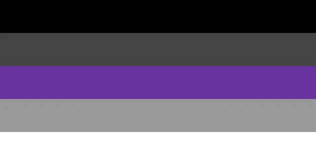

- 👋 Hi,  My name is Bashir, but my friends call me Bash. You can too!🥳
I am a passionate iOS developer and a freelance software engineer from Nigeria. I love the soft life.
I am also an open-source enthusiast and maintainer. I learned a lot from the open-source community and love how collaboration and knowledge sharing happens through open-source.
 
  
 
 
- 🌱 I’m currently working with Swift, UIKit, Flutter and Dart
- 💞️ I’m looking to collaborate on projects to help me build my skills
- 📫 I can be reached at yesufubashir@gmail.com

 
<!---
BashirYesufu/BashirYesufu is a ✨ special ✨ repository because its `README.md` (this file) appears on your GitHub profile.
You can click the Preview link to take a look at your changes.
--->
